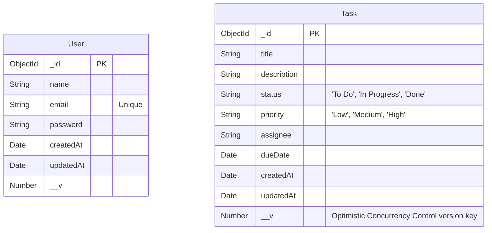

# MongoDB Schema Diagram

The following Entity-Relationship diagram outlines the schema structure for the **collab-board** application using Mongoose.

```mermaid
erDiagram
    User {
        ObjectId _id PK
        String name
        String email "Unique"
        String password
        Date createdAt
        Date updatedAt
        Number __v
    }

    Task {
        ObjectId _id PK
        String title
        String description
        String status "'To Do', 'In Progress', 'Done'"
        String priority "'Low', 'Medium', 'High'"
        String assignee
        Date dueDate
        Date createdAt
        Date updatedAt
        Number __v "Optimistic Concurrency Control version key"
    }
```
